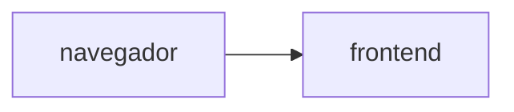
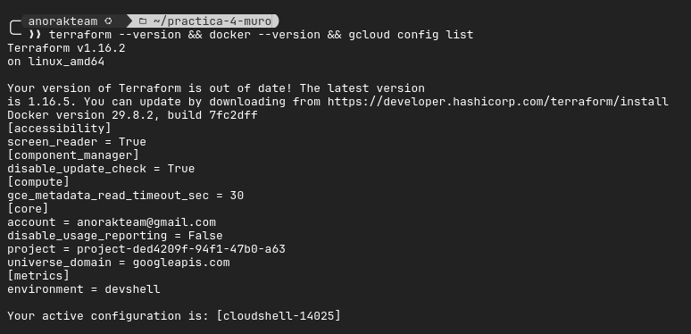
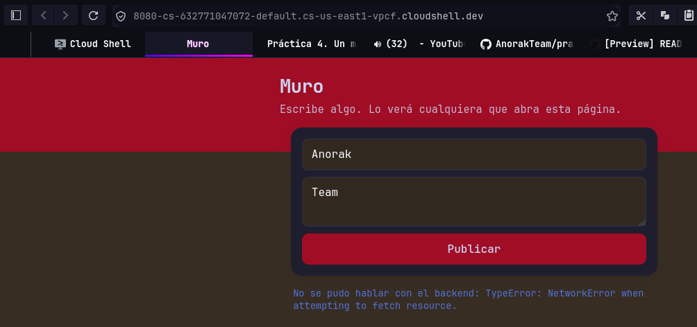
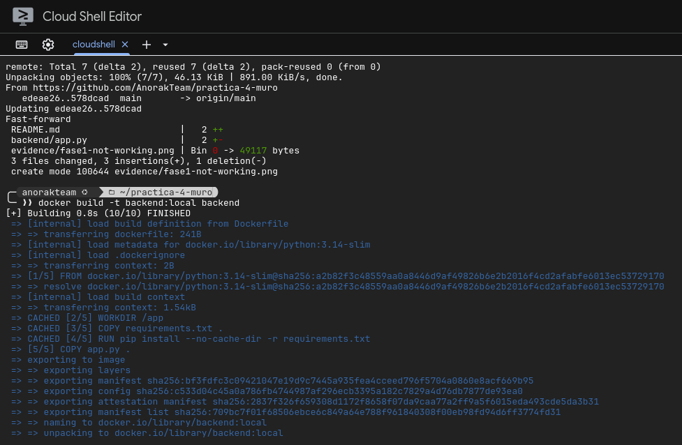
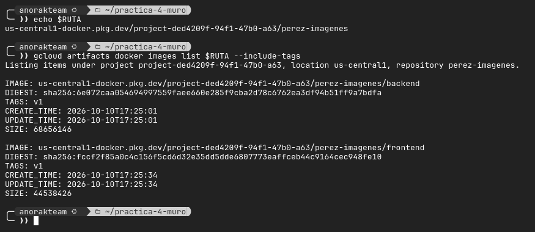
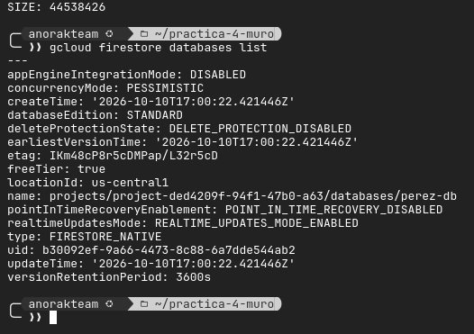
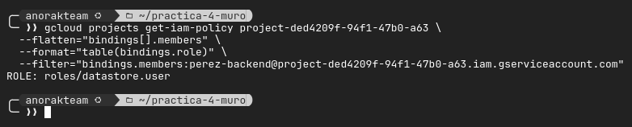

# Muro de mensajes

**Equipo: 3**
**Proyecto de Google Cloud: project-ded4209f-94f1-47b0-a63**
**URL del muro:**

## Diagrama



## Fase 0. Preparación

Se contaba con las utilidades instaladas para terraform y docker, y se procedió a instalar `hey`. 

Output en texto de los comandos de evidencia:

```bash
$ terraform --version && docker --version && gcloud config list
Terraform v1.16.2

{texto de actualizar terraform}

on linux_amd64
Docker version 29.8.2, build 7fc2dff
[accessibility]
screen_reader = True
[component_manager]
disable_update_check = True
[compute]
gce_metadata_read_timeout_sec = 30
[core]
account = anorakteam@gmail.com
disable_usage_reporting = False
project = project-ded4209f-94f1-47b0-a63
universe_domain = googleapis.com
[metrics]
environment = devshell
```



## Fase 1. Las imágenes

Se muestra la página generada, sin poder comunicarse con el backend:



Y el backend reconstruido luego de cambiar una palabra del comentario:



## Fase 2. Los cimientos

> NOTA IMPORTANTE: Dentro del entorno de cloud shell, por alguna razón, no permitía a Docker pushear las imágenes al artifact registry, así que se habilitó y utilizó el servicio de cloud build para subir esas imágenes.

Las imágenes se subieron al registro luego de ser construidas:



Luego, se listó con gcloud directamente las bases de datos de firestore existentes:



Y por último, la cuenta del backend con los permisos de user para lectura y escritura en firestore:



## Fase 3. El backend

## Fase 4. El frontend, conectado

## Fase 5. El estado vive afuera

## Fase 6. Reto

### Decisiones

### Preguntas
